# 📖 Instrukcja Użytkowania - AI Code Debugger

**Metadata:**

- **Autor**: Sebastian Ciborowski
- **Data**: 15.07.2025
- **Wersja**: 1.0
- **Projekt**: AI Code Debugger
- **Typ dokumentu**: Instrukcja użytkowania


## 📋 Spis Treści

1. [Wprowadzenie do AI Code Debugger](#1-wprowadzenie-do-ai-code-debugger)
2. [Wymagania Systemowe](#2-wymagania-systemowe)
3. [Instalacja i Pierwsze Uruchomienie](#3-instalacja-i-pierwsze-uruchomienie)
4. [Interfejs Użytkownika](#4-interfejs-u%C5%BCytkownika)
5. [Podstawowe Funkcje](#5-podstawowe-funkcje)
6. [Analiza Kodu](#6-analiza-kodu)
7. [Praca z Wynikami](#7-praca-z-wynikami)
8. [Najczęstsze Problemy](#8-najcz%C4%99stsze-problemy)
9. [Wskazówki i Najlepsze Praktyki](#9-wskaz%C3%B3wki-i-najlepsze-praktyki)
10. [Często Zadawane Pytania](#10-cz%C4%99sto-zadawane-pytania)

## 1. Wprowadzenie do AI Code Debugger

### 1.1 Czym jest AI Code Debugger

**AI Code Debugger** to zaawansowana aplikacja desktopowa przeznaczona do analizy kodu Python z wykorzystaniem sztucznej inteligencji. Aplikacja wykorzystuje model **GPT-4.1** do generowania inteligentnych sugestii naprawczych dla wykrytych błędów i problemów w kodzie.

### 1.2 Główne Funkcje

🔍 **Analiza kodu Python** - wykrywanie błędów składniowych i logicznych
🤖 **Sugestie AI** - inteligentne rekomendacje naprawcze od GPT-4.1
🎨 **Podświetlanie składni** - kolorowanie kodu dla lepszej czytelności
📏 **Numeracja linii** - łatwe odnajdywanie błędów
📚 **Historia analiz** - przechowywanie poprzednich rezultatów

### 1.3 Korzyści z Użytkowania

| Korzyść | Opis |
| :-- | :-- |
| ✅ **Szybsze debugowanie** | Automatyczne wykrywanie problemów |
| ✅ **Nauka programowania** | Wyjaśnienia i sugestie poprawek |
| ✅ **Oszczędność czasu** | Redukcja czasu spędzonego na szukaniu błędów |
| ✅ **Poprawa jakości kodu** | Rekomendacje najlepszych praktyk |

## 2. Wymagania Systemowe

### 2.1 Wymagania Minimalne

| Komponent | Specyfikacja |
| :-- | :-- |
| **System operacyjny** | Windows 10 (wersja 1903 lub nowsza) |
| **Procesor** | Intel Core i3 lub AMD Ryzen 3 |
| **Pamięć RAM** | 4 GB |
| **Miejsce na dysku** | 200 MB wolnej przestrzeni |
| **Połączenie internetowe** | Wymagane do komunikacji z API OpenAI |

### 2.2 Wymagania Zalecane

| Komponent | Specyfikacja |
| :-- | :-- |
| **System operacyjny** | Windows 11 |
| **Procesor** | Intel Core i5 lub AMD Ryzen 5 |
| **Pamięć RAM** | 8 GB lub więcej |
| **Miejsce na dysku** | 500 MB wolnej przestrzeni |
| **Połączenie internetowe** | Szerokopasmowe połączenie |

### 2.3 Dodatkowe Informacje

💡 **Ważne informacje:**

- Aplikacja nie wymaga uprawnień administratora
- Działa w trybie offline dla podstawowych funkcji (bez sugestii AI)
- Obsługuje pliki Python (.py) do 10 MB


## 3. Instalacja i Pierwsze Uruchomienie

### 3.1 Pobieranie Aplikacji

1. Pobierz plik `AICodeDebugger.exe` z repozytorium GitHub
2. Zapisz plik w wybranej lokalizacji na dysku
3. **Nie jest wymagana dodatkowa instalacja**

### 3.2 Pierwsze Uruchomienie

#### 3.2.1 Uruchomienie Aplikacji

1. Kliknij dwukrotnie na plik `AICodeDebugger.exe`
2. Windows może wyświetlić ostrzeżenie - kliknij **"Więcej informacji"** → **"Uruchom mimo to"**
3. Aplikacja uruchomi się i wyświetli główne okno

#### 3.2.2 Pierwsze Wyświetlenie

Po uruchomieniu zobaczysz:

- 🖥️ Główne okno aplikacji z podziałem na dwie części
- ✏️ Panel edytora kodu po lewej stronie
- 📊 Panel wyników po prawej stronie
- 🔧 Pasek narzędzi u góry z przyciskami funkcji


## 4. Interfejs Użytkownika

### 4.1 Główne Okno Aplikacji

Aplikacja składa się z następujących elementów:

```
┌─────────────────────────────────────────────────────────┐
│ [📁 Otwórz plik] [🔍 Analizuj] [🗑️ Wyczyść]           │
├─────────────────┬───────────────────────────────────────┤
│                 │ Błędy | Sugestie AI | Metryki | Historia│
│   EDYTOR KODU   │                                       │
│                 │           PANEL WYNIKÓW               │
│                 │                                       │
└─────────────────┴───────────────────────────────────────┘
```


### 4.2 Pasek Narzędzi

**Dostępne przyciski:**


| Przycisk | Funkcja |
| :-- | :-- |
| 📁 **Otwórz plik** | Wczytuje plik Python do analizy |
| 🔍 **Analizuj** | Rozpoczyna analizę aktualnego kodu |
| 🗑️ **Wyczyść** | Czyści edytor i wyniki |

### 4.3 Panel Edytora Kodu

**Lokalizacja:** Lewa strona aplikacji

**Funkcje:**

- 📝 Edycja kodu Python
- 📏 Numeracja linii
- 🎨 Podświetlanie składni


### 4.4 Panel Wyników

**Lokalizacja:** Prawa strona aplikacji

**Zakładki dostępne:**

- 🐛 **Błędy** - lista wykrytych problemów w kodzie
- 🤖 **Sugestie AI** - rekomendacje naprawcze od GPT-4.1
- 📊 **Metryki** - podstawowe statystyki kodu
- 📚 **Historia** - poprzednie analizy


## 5. Podstawowe Funkcje

### 5.1 Otwieranie Plików

**Jak otworzyć plik:**

1. Kliknij przycisk **"📁 Otwórz plik"**
2. Wybierz plik Python (.py) z dysku
3. Kod zostanie załadowany do edytora

**Obsługiwane formaty:**

- `.py` - pliki Python
- **Maksymalny rozmiar:** 10 MB


### 5.2 Edycja Kodu

**Podstawowe funkcje edytora:**

- ✏️ Wpisywanie i edycja kodu Python
- 📏 Numeracja linii po lewej stronie
- 🎨 Automatyczne podświetlanie składni


### 5.3 Czyszczenie Edytora

**Jak wyczyścić edytor:**

1. Kliknij przycisk **"🗑️ Wyczyść"**
2. Edytor i panel wyników zostaną wyczyszczone
3. Możesz rozpocząć pracę z nowym kodem

## 6. Analiza Kodu

### 6.1 Rozpoczynanie Analizy

**Kroki analizy:**

1. 📂 Wczytaj kod do edytora (plik lub wpisz ręcznie)
2. 🔍 Kliknij przycisk **"Analizuj"**
3. ⏳ Poczekaj na zakończenie procesu
4. 📋 Wyniki pojawią się w panelu po prawej stronie

### 6.2 Proces Analizy

**Co dzieje się podczas analizy:**

```mermaid
graph LR
    A[📝 Analiza składni] --> B[🐛 Wykrywanie błędów]
    B --> C[🤖 Komunikacja z AI]
    C --> D[💡 Generowanie sugestii]
```



1. **Analiza składni** - sprawdzenie poprawności kodu
2. **Wykrywanie błędów** - identyfikacja problemów
3. **Komunikacja z AI** - przesłanie zapytania do GPT-4.1
4. **Generowanie sugestii** - otrzymanie rekomendacji naprawczych

⏱️ **Czas analizy:** Zwykle 5-15 sekund (zależny od długości kodu)

## 7. Praca z Wynikami

### 7.1 Zakładka "🐛 Błędy"

**Zawartość:**

- 📍 Lista wykrytych błędów w kodzie
- 📏 Numer linii gdzie występuje błąd
- 🏷️ Typ błędu (składniowy, logiczny)
- 📝 Opis problemu

**Format wyświetlania:**

```
📍 Linia 15: SyntaxError - Missing closing parenthesis
📍 Linia 23: NameError - Variable 'x' is not defined
```


### 7.2 Zakładka "🤖 Sugestie AI"

**Zawartość:**

- 💡 Sugestie naprawcze wygenerowane przez GPT-4.1
- 📖 Wyjaśnienia problemów
- 💻 Przykłady poprawnego kodu
- ⭐ Rekomendacje najlepszych praktyk


### 7.3 Pozostałe Zakładki

**📊 Metryki:**

- Podstawowe statystyki analizowanego kodu

**📚 Historia:**

- Przechowuje poprzednie analizy kodu


## 8. Najczęstsze Problemy

### 8.1 Problemy z Uruchomieniem

| Problem | Rozwiązanie |
| :-- | :-- |
| 🚫 **Aplikacja nie uruchamia się** | -  Sprawdź czy masz Windows 10/11<br>-  Uruchom jako administrator (jeśli potrzeba)<br>-  Sprawdź czy plik nie jest zablokowany przez antywirus |
| ⚠️ **Ostrzeżenie bezpieczeństwa Windows** | -  Kliknij "Więcej informacji" → "Uruchom mimo to"<br>-  Przyczyna: Aplikacja nie ma certyfikatu cyfrowego |

### 8.2 Problemy z Analizą

| Problem | Rozwiązanie |
| :-- | :-- |
| ⏸️ **Analiza się nie rozpoczyna** | -  Sprawdź połączenie internetowe<br>-  Upewnij się że kod nie jest pusty<br>-  Sprawdź czy plik nie przekracza 10 MB |
| 🤖 **Brak sugestii AI** | -  Przyczyna: Brak połączenia z internetem<br>-  Sprawdź połączenie i spróbuj ponownie |

### 8.3 Problemy z Plikami

| Problem | Rozwiązanie |
| :-- | :-- |
| 📂 **Nie można otworzyć pliku** | -  Sprawdź czy plik ma rozszerzenie .py<br>-  Sprawdź uprawnienia do pliku<br>-  Sprawdź czy plik nie jest uszkodzony |

## 9. Wskazówki i Najlepsze Praktyki

### 9.1 Optymalne Używanie Aplikacji

#### 📝 Przygotowanie kodu:

- ✅ Upewnij się że kod jest zapisany w kodowaniu UTF-8
- ✅ Usuń zbędne komentarze przed analizą
- ✅ Podziel bardzo długie pliki na mniejsze części


#### 🔍 Analiza kodu:

- ✅ Analizuj kod częściami dla lepszych wyników
- ✅ Sprawdź sugestie AI zanim zastosując zmiany
- ✅ Zapisuj wyniki dla późniejszego porównania


### 9.2 Poprawa Wydajności

#### ⚡ Szybsza analiza:

- 📏 Używaj plików o rozmiarze do 1 MB dla najszybszych rezultatów
- 🖥️ Zamknij inne aplikacje podczas analizy
- 🌐 Sprawdź stabilność połączenia internetowego


### 9.3 Interpretacja Wyników

#### 🧠 Jak czytać sugestie AI:

- ✅ Zawsze sprawdź logikę sugerowanych zmian
- ⚠️ Nie stosuj automatycznie wszystkich sugestii
- 📚 Ucz się na otrzymanych wyjaśnieniach


## 10. Często Zadawane Pytania

### 10.1 Pytania Ogólne

**❓ Czy aplikacja jest bezpłatna?**
✅ Tak, aplikacja jest dostępna za darmo

**❓ Czy potrzebuję klucza API OpenAI?**
✅ Nie, klucze są wbudowane w aplikację

**❓ Czy aplikacja działa offline?**
⚠️ Częściowo - podstawowa analiza tak, sugestie AI wymagają internetu

### 10.2 Pytania Techniczne

**❓ Jakie języki programowania są obsługiwane?**
✅ Obecnie tylko Python (.py)

**❓ Jak dokładne są sugestie AI?**
✅ GPT-4.1 ma wysoką dokładność (~85-95%) dla typowych problemów Python

**❓ Czy mogę analizować większe projekty?**
✅ Tak, ale analizuj pliki pojedynczo (maksymalnie 10 MB na plik)

### 10.3 Pytania o Bezpieczeństwo

**❓ Czy mój kod jest wysyłany do OpenAI?**
✅ Tak, fragmenty kodu są wysyłane do analizy, ale nie są przechowywane

**❓ Czy aplikacja jest bezpieczna?**
✅ Tak, aplikacja nie zbiera danych osobowych ani nie instaluje dodatkowego oprogramowania

**❓ Gdzie są przechowywane wyniki analiz?**
✅ Lokalnie na Twoim komputerze w bazie danych aplikacji

### 10.4 Wsparcie i Pomoc

**❓ Gdzie mogę zgłosić błąd?**
✅ Na stronie GitHub projektu w sekcji Issues

**❓ Jak mogę zaproponować nową funkcję?**
✅ Przez sekcję Issues na GitHub lub bezpośredni kontakt z autorem

**❓ Czy planowane są aktualizacje?**
✅ Tak, regularnie dodawane są nowe funkcje i poprawki

## 📞 Informacje Kontaktowe

- **Autor:** Sebastian Ciborowski
- **Projekt:** AI Code Debugger
- **Wersja dokumentacji:** 1.0
- **Data aktualizacji:** 15.07.2025
- **GitHub:** github.com/sebastian-c87

## 🎉 Podziękowania

**Dziękujemy za korzystanie z AI Code Debugger!** Mamy nadzieję, że aplikacja pomoże Ci w codziennej pracy z kodem Python.

> 💡 **Wskazówka:** Regularne korzystanie z aplikacji pomoże Ci nie tylko znajdować błędy, ale także uczyć się lepszych praktyk programowania w Python!

